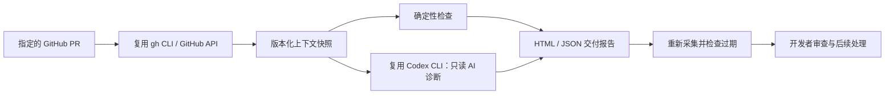

# 研序 · Yanxu Dev

**把 GitHub PR、CI 和 AI 诊断整理成一份与代码版本绑定的交付审查报告，并在隔离副本中验证修复。**

v0.8 是可运行的命令行工具：一条 `workflow` 命令先体检仓库并建立需求任务合同，PR 创建后采集并复核 GitHub 证据；也可分别诊断失败、调用现有 Codex CLI、在独立副本准备补丁和执行显式测试，最后记录配对任务并评测人工时间和质量。

它不改原工作区的代码，不批准 PR、merge 或部署。长期目标是完整研发交付平台，先验证这个具体环节的价值。

已完成 [真实 PR 演示](https://github.com/guannan1031/yanxu-dev/pull/1)：CI 失败 → AI 诊断 → 开发者修复 → 旧报告过期 → PR/main CI 通过。[运行证据与简历表述](docs/VALIDATION.md) · [历史演示报告 HTML](docs/index.html)。

v0.2 新增：[受限补丁准备与回放验证](docs/PATCH_PREPARATION.md)。

v0.3 新增：[`test-fix` 隔离测试验证](docs/PATCH_PREPARATION.md#test-fix)。它使用记录的 commit 构建完整归档，应用同一建议补丁，执行开发者明确给出的测试命令，并保存通过、失败或超时证据。

v0.4 新增：[`task` 需求任务合同](docs/TASK_CONTRACT.md)。它只读取项目规则、README、构建配置和 CI 工作流等白名单上下文，生成可交给开发者或 Agent 的 JSON / Markdown 合同。

v0.5 新增：[`benchmark` 配对提效评测](docs/EFFICIENCY_BENCHMARK.md)。它在范围一致且两边质量通过时计算观察到的人工时间减少率，并输出 JSON、Markdown 和 HTML 报告。

v0.6 新增：[`record` 真实观察记录器](docs/MEASUREMENT_RECORDING.md)。它分两次记录基线与研序数据，保留人工分钟、质量、返工和证据引用；已有观察默认禁止覆盖。

v0.7 新增：[`doctor` AI Coding 项目体检](docs/REPOSITORY_DOCTOR.md)。它检查规则、启动说明、构建、测试、CI 和密钥边界，只读取工程元数据，业务源码扫描数为 0。

v0.8 新增：[`workflow` 一键研发交付工作流](docs/DELIVERY_WORKFLOW.md)。开发前串联项目体检与任务合同，PR 创建后继续完成 PR/CI 事实采集和同次执行内的证据复核；阻断即停止，始终不授权自动合并。

## 快速开始

需要 Python 3.11+、[GitHub CLI](https://cli.github.com/)；AI 模式额外需要已登录的 [Codex CLI](https://github.com/openai/codex)。本次兼容性以 Codex CLI 0.137.0 为准。

```bash
git clone https://github.com/guannan1031/yanxu-dev.git
cd yanxu-dev
gh auth login

# 无模型模式：只采集事实、检查状态并生成报告
python -m yanxu review --repo OWNER/REPO --pr 123

# AI 模式：显式同意将本次 PR 内容交给自己的 Codex 模型服务
codex login
python -m yanxu review --repo OWNER/REPO --pr 123 --ai --include-failed-logs

# 打开命令输出中的 report.html；重新核对 evidence.json 是否过期
python -m yanxu verify runs/RUN_ID/evidence.json

# 将 AI 建议应用到独立副本：必须明确授权每一个文件
python -m yanxu prepare-fix runs/RUN_ID/evidence.json --checkout /path/to/repo --allow-path src/example.py

# 在完整 commit 归档中应用建议并运行测试；--command 之后的参数原样传给可执行文件
python -m yanxu test-fix --checkout /path/to/repo --allow-path src/example.py \
  runs/RUN_ID/evidence.json --command python3.11 -m unittest discover -s tests -v

# 重放仓库内已有的公开历史案例，不访问 GitHub，不制造新的失败 CI
python -m yanxu prepare-fix docs/demo-evidence.json --checkout . --allow-path sample/pagination.py --replay

# 无需账号、网络或模型的自动化测试
python -m unittest discover -s tests -v

# 将需求和当前项目上下文固化成任务合同
python -m yanxu task "Add a safe pagination endpoint" --repo . --output runs/tasks

# 用配对任务记录生成提效报告；示例明确标记为 synthetic，不能作为收益结论
python -m yanxu benchmark docs/benchmark-synthetic-example.json --output runs/benchmark

# 真实使用时分别记录基线与研序两侧；示例参数需要替换为实际测量值和证据
python -m yanxu record runs/observed.json --scope "Python bug fixes / 2026-09" \
  --task-id BUG-123 --task-type bugfix --variant baseline --human-minutes 30 \
  --quality-passed --rework-count 1 --evidence "PR-123/baseline-notes.md" --same-scope

python -m yanxu record runs/observed.json --scope "Python bug fixes / 2026-09" \
  --task-id BUG-123 --task-type bugfix --variant yanxu --human-minutes 18 \
  --quality-passed --rework-count 0 --evidence "PR-123/yanxu-report.json" --same-scope

python -m yanxu benchmark runs/observed.json --output runs/observed-report

# 开发前检查仓库是否具备受约束 AI Coding 的基本条件
python -m yanxu doctor --repo . --output runs/doctor

# 一键完成开发前工作流；创建 PR 后补充 --github-repo owner/repo --pr 12
python -m yanxu workflow "Add a safe pagination endpoint" --repo . --output runs/workflow
```

运行结果位于 `runs/`，默认不提交 Git。可选 `pip install -e .` 后使用 `yanxu` 命令。没有后台进程、数据库或浏览器扩展需要配置。

## 已实现

| 能力 | 输入与处理 | 输出与验收 |
|---|---|---|
| GitHub 上下文采集 | 指定 repo/PR；读取 diff、checks、status、review；可选失败日志 | 原始事实快照；采集中 head/base 变化则拒绝 |
| 确定性审查 | 检查失败/等待、缺失 diff、旧审批、敏感路径 | `BLOCKED` 或 `MANUAL_REVIEW`，永不返回自动合并授权 |
| AI 诊断 | 将有范围上限的快照交给 Codex；结构化输出校验 | 有证据的发现、修复步骤、建议 diff、明确局限 |
| 交付报告 | 汇总事实、建议、版本指纹和耗时 | 自包含 HTML、evidence.json、执行事件；AI 失败仍保留事实报告 |
| 过期核验 | 重新读取同一 PR | head/base/checks/reviews/diff 变化时返回 `STALE`，退出码 2 |
| 受限补丁准备 | 显式文件清单、已记录提交、AI 建议；默认重新核对 GitHub | 新目录中的最小源码副本、标准 diff、manifest；原代码不变，测试/隐藏文件/符号链接/重命名拒绝 |
| 隔离修复验证 | 完整 commit 归档、同一建议补丁、显式测试命令和超时 | `COMPLETED`、`FAILED_TESTS` 或 `TIMED_OUT` manifest、测试日志；原 checkout 与远端不变 |
| 需求任务合同 | 需求文本、规则/README/构建配置/CI 白名单上下文 | `task.json`、`task.md`、建议测试入口和验收条件；不扫描业务源码、不写远端 |
| 配对提效评测 | 同范围任务的人工基线、研序用时、质量与返工记录 | `benchmark.json`、Markdown、HTML；不合格样本排除，少于 5 个真实有效任务只标记探索性 |
| 真实观察记录 | 任务范围、基线/研序侧、人工分钟、质量、返工、证据引用 | 可追加的 observed JSON；完成度可见，同一侧不覆盖，范围变化拒绝 |
| AI Coding 项目体检 | 项目规则、README、构建/测试/CI 和密钥边界 | `READY` 或 `NEEDS_WORK`、整改清单、JSON/Markdown/HTML；业务源码扫描数为 0 |
| 一键研发交付工作流 | 需求、本地仓库、可选 GitHub repo/PR | 串联体检、任务合同、PR/CI 采集和证据复核；阻断短路，输出统一执行轨迹 |
| 本项目 CI | `pull_request` 和 `push` 到 main | Python 3.11/3.13 的独立契约与回归测试 |

`UNCHANGED` 仅表示重新采集时一致，不保证下一刻仍一致。指纹用于版本对账，不是防恶意篡改的数字签名。CODEOWNERS、所有 required checks 和仓库规则尚未完整计算，GitHub 自身规则和人工审查仍然必要。

`prepare-fix` 返回 `PREPARED_NOT_TESTED`：只说明补丁适用性和路径检查通过，**不代表测试通过**。`test-fix` 才会在临时完整归档中执行显式测试命令；它提供进程、目录和凭据环境隔离，但不是强化安全沙箱，不能运行不受信任的命令。只支持已有的 UTF-8/LF 普通文本文件。审查标准 diff 后，再由开发者通过正常分支与 CI 验证。`--replay` 明确标记历史回放，跳过在线新鲜度核验，不能作为当前 PR 的合并依据。

## 复用与自研



我们实现项目体检、任务工作流、上下文合同、版本绑定、规则检查、结构化报告、过期核验、受限补丁准备、隔离测试验证与配对提效评测；编码/模型能力复用成熟执行器。尚未实现 LangGraph、多 Agent、向量 RAG、PostgreSQL、自动创建修复 PR、自动合并或生产部署，不应在简历中写成已完成。

选择 Codex CLI 是为了复用现有环境，先交付可用版本；OpenHands SDK、gh-aw 和 Open SWE 仍是后续比较对象，不是本仓库已接入的依赖。

## 效果如何测量

当前还没有足够真实配对样本，因此不宣称研发效率提升百分比。报告中的秒数是一次采集与诊断的机器墙钟时间。

比较“现有 AI Coding + 手动整理 PR/CI”与“同等模型 + 研序”，记录同类任务的人工操作、审查、更正、等待、失败和支持投入，质量通过后才计算：

`人工时间减少率 = (基线人工分钟 - 使用研序的人工分钟) / 基线人工分钟 × 100%`

`benchmark` 只纳入范围一致且基线、研序两边质量都通过的任务；少于 5 个真实有效配对任务标记 `EXPLORATORY`，合成数据标记 `DEMO_ONLY`。结果必须注明样本量、任务范围和观察限制，不能直接外推成整个团队的开发效率。实际验证记录与可用的简历表述见 [docs/VALIDATION.md](docs/VALIDATION.md)。

## 数据和权限

- 只调用 GitHub 读取接口，不使用提交、评论、审查、merge 或部署 API。
- 默认不调用模型；`--ai` 才将该 PR 的标题、正文、代码差异、检查/审批信息，以及选择加入的失败日志交给使用者配置的 Codex 服务。
- 模型使用临时目录、只读沙箱，关闭 shell、子 Agent、应用工具和网页搜索；不继承 GitHub/cloud 凭据或用户 MCP 配置。建议补丁仅作文字展示。
- 采集结果有长度上限，缺失/截断明确标识。私有仓库报告仍属于私有材料；正则脱敏只是辅助，不保证识别所有秘密。
- 不需要把 API Key、Token 或客户代码放入本项目；登录由相应 CLI 管理。报告分享前应检查内容。

## 为什么 GitHub 历史上有一次红灯

2026-09-13 的 [演示运行 34753701587](https://github.com/guannan1031/yanxu-dev/actions/runs/34753701587) 主动引入合成分页缺陷，以验证真实失败诊断。它已由后续提交修复；历史邮件或红灯不会随修复消失。[修复后 PR CI](https://github.com/guannan1031/yanxu-dev/actions/runs/34753802102) 和 [合并后 CI](https://github.com/guannan1031/yanxu-dev/actions/runs/34753866731) 均通过。日常使用和后续回放不需要再主动制造失败的远端运行；失败场景通过预期失败断言测试。

## CI 与 CD

合并前的 PR CI 校验候选改动，合并后的 main CI 验证实际主分支。v0.1 没有运行 CD，也不把合并或 CI 通过称作部署完成。将来接 CD 时，必须对应不可变制品、目标环境版本与验收结果。

## 商业路线

先让有 GitHub/CI 的小团队验证诊断和材料整理是否省时，再提供固定范围接入、团队规则配置与维护支持。有持续需求后再建设托管版。当前无客户收益或收入声明。

## 许可证

本仓库原创代码使用 MIT。外部 Codex CLI 是独立的 Apache-2.0 项目；GitHub、模型服务及其认证/费用按各自条款使用。见 [THIRD_PARTY.md](THIRD_PARTY.md)。
