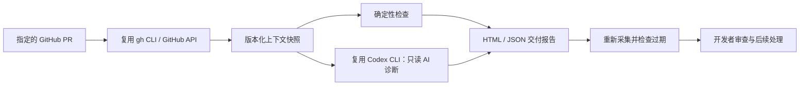

# 研序 · Yanxu Dev

**把 GitHub PR、CI 和 AI 诊断整理成一份与代码版本绑定的交付审查报告。**

v0.1 是可运行的命令行工具：读取真实 GitHub PR，生成本地 HTML / JSON 报告，可调用现有 Codex CLI 诊断失败和提出补丁建议。适合开发者和维护者减少查改动、找检查记录、整理审查材料的往返。

它不自动修改代码、批准 PR、merge 或部署。长期目标是完整研发交付平台，首版先验证这个具体环节的价值。

已完成 [真实 PR 演示](https://github.com/guannan1031/yanxu-dev/pull/1)：CI 失败 → AI 诊断 → 开发者修复 → 旧报告过期 → PR/main CI 通过。[运行证据与简历表述](docs/VALIDATION.md) · [历史演示报告 HTML](docs/index.html)。

## 快速开始

需要 Python 3.11+、[GitHub CLI](https://cli.github.com/)；AI 模式额外需要已登录的 [Codex CLI](https://github.com/openai/codex)。本次兼容性以 Codex CLI 0.137.0 为准。

```bash
git clone https://github.com/guannan1031/yanxu-dev.git
cd yanxu-dev
gh auth login

# 无模型模式：只采集事实、检查状态并生成报告
python -m yanxu review --repo OWNER/REPO --pr 123

# AI 模式：显式同意将本次 PR 内容交给自己的 Codex 模型服务
codex login
python -m yanxu review --repo OWNER/REPO --pr 123 --ai --include-failed-logs

# 打开命令输出中的 report.html；重新核对 evidence.json 是否过期
python -m yanxu verify runs/RUN_ID/evidence.json

# 无需账号、网络或模型的自动化测试
python -m unittest discover -s tests -v
```

运行结果位于 `runs/`，默认不提交 Git。可选 `pip install -e .` 后使用 `yanxu` 命令。没有后台进程、数据库或浏览器扩展需要配置。

## 已实现

| 能力 | 输入与处理 | 输出与验收 |
|---|---|---|
| GitHub 上下文采集 | 指定 repo/PR；读取 diff、checks、status、review；可选失败日志 | 原始事实快照；采集中 head/base 变化则拒绝 |
| 确定性审查 | 检查失败/等待、缺失 diff、旧审批、敏感路径 | `BLOCKED` 或 `MANUAL_REVIEW`，永不返回自动合并授权 |
| AI 诊断 | 将有范围上限的快照交给 Codex；结构化输出校验 | 有证据的发现、修复步骤、建议 diff、明确局限 |
| 交付报告 | 汇总事实、建议、版本指纹和耗时 | 自包含 HTML、evidence.json、执行事件；AI 失败仍保留事实报告 |
| 过期核验 | 重新读取同一 PR | head/base/checks/reviews/diff 变化时返回 `STALE`，退出码 2 |
| 本项目 CI | `pull_request` 和 `push` 到 main | Python 3.11/3.13 的独立契约与回归测试 |

`UNCHANGED` 仅表示重新采集时一致，不保证下一刻仍一致。指纹用于版本对账，不是防恶意篡改的数字签名。CODEOWNERS、所有 required checks 和仓库规则尚未完整计算，GitHub 自身规则和人工审查仍然必要。

## 复用与自研



我们实现上下文汇总、版本绑定、规则检查、结构化报告和过期核验；编码/模型能力复用成熟执行器。v0.1 没有实现 LangGraph、多 Agent、向量 RAG、PostgreSQL、自动修复、自动合并或生产部署，不应在简历中写成已完成。

选择 Codex CLI 是为了复用现有环境，先交付可用版本；OpenHands SDK、gh-aw 和 Open SWE 仍是后续比较对象，不是本仓库已接入的依赖。

## 效果如何测量

当前不宣称研发效率提升百分比。报告中的秒数是一次采集与诊断的机器墙钟时间。

比较“现有 AI Coding + 手动整理 PR/CI”与“同等模型 + 研序”，记录同类任务的人工操作、审查、更正、等待、失败和支持投入，质量通过后才计算：

`人工时间减少率 = (基线人工分钟 - 使用研序的人工分钟) / 基线人工分钟 × 100%`

要注明样本量、任务范围和观察限制；这个结果也不能直接外推成整个团队的开发效率。合成 PR 演示验证功能，不证明客户收益。实际验证记录与可用的简历表述见 [docs/VALIDATION.md](docs/VALIDATION.md)。

## 数据和权限

- 只调用 GitHub 读取接口，不使用提交、评论、审查、merge 或部署 API。
- 默认不调用模型；`--ai` 才将该 PR 的标题、正文、代码差异、检查/审批信息，以及选择加入的失败日志交给使用者配置的 Codex 服务。
- 模型使用临时目录、只读沙箱，关闭 shell、子 Agent、应用工具和网页搜索；不继承 GitHub/cloud 凭据或用户 MCP 配置。建议补丁仅作文字展示。
- 采集结果有长度上限，缺失/截断明确标识。私有仓库报告仍属于私有材料；正则脱敏只是辅助，不保证识别所有秘密。
- 不需要把 API Key、Token 或客户代码放入本项目；登录由相应 CLI 管理。报告分享前应检查内容。

## CI 与 CD

合并前的 PR CI 校验候选改动，合并后的 main CI 验证实际主分支。v0.1 没有运行 CD，也不把合并或 CI 通过称作部署完成。将来接 CD 时，必须对应不可变制品、目标环境版本与验收结果。

## 商业路线

先让有 GitHub/CI 的小团队验证诊断和材料整理是否省时，再提供固定范围接入、团队规则配置与维护支持。有持续需求后再建设托管版。当前无客户收益或收入声明。

## 许可证

本仓库原创代码使用 MIT。外部 Codex CLI 是独立的 Apache-2.0 项目；GitHub、模型服务及其认证/费用按各自条款使用。见 [THIRD_PARTY.md](THIRD_PARTY.md)。
