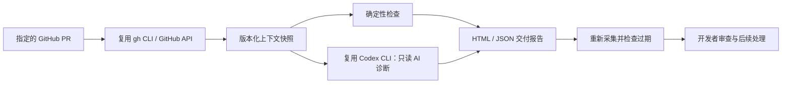

# 研序 · Yanxu Dev

**把 GitHub PR、CI 和 AI 诊断整理成一份与代码版本绑定的交付审查报告，并在隔离副本中验证修复。**

v0.20.0 是可运行的开源 CLI 与可选私有团队服务：除受控生成、隔离测试、PR/CI 核验和 GitHub Webhook 队列外，团队可以用浏览器查看跨项目状态，记录验收标准、客户确认、支持投入和实际成本，导出试点证据 ZIP，并通过跨平台命令初始化、检查、备份和恢复私有部署。

它不改原工作区的代码，不批准 PR、merge 或部署。长期目标是完整研发交付平台，先验证这个具体环节的价值。

已完成 [真实 PR 演示](https://github.com/guannan1031/yanxu-dev/pull/1)：CI 失败 → AI 诊断 → 开发者修复 → 旧报告过期 → PR/main CI 通过。[运行证据与简历表述](docs/VALIDATION.md) · [私有团队工作台](docs/PILOT_DASHBOARD.md) · [团队 GitHub 同步演示](docs/team-github-demo.html) · [历史演示报告 HTML](docs/index.html)。

v0.2 新增：[受限补丁准备与回放验证](docs/PATCH_PREPARATION.md)。

v0.3 新增：[`test-fix` 隔离测试验证](docs/PATCH_PREPARATION.md#test-fix)。它使用记录的 commit 构建完整归档，应用同一建议补丁，执行开发者明确给出的测试命令，并保存通过、失败或超时证据。

v0.4 新增：[`task` 需求任务合同](docs/TASK_CONTRACT.md)。它只读取项目规则、README、构建配置和 CI 工作流等白名单上下文，生成可交给开发者或 Agent 的 JSON / Markdown 合同。

v0.5 新增：[`benchmark` 配对提效评测](docs/EFFICIENCY_BENCHMARK.md)。它在范围一致且两边质量通过时计算观察到的人工时间减少率，并输出 JSON、Markdown 和 HTML 报告。

v0.6 新增：[`record` 真实观察记录器](docs/MEASUREMENT_RECORDING.md)。它分两次记录基线与研序数据，保留人工分钟、质量、返工和证据引用；已有观察默认禁止覆盖。

v0.7 新增：[`doctor` AI Coding 项目体检](docs/REPOSITORY_DOCTOR.md)。它检查规则、启动说明、构建、测试、CI 和密钥边界，只读取工程元数据，业务源码扫描数为 0。

v0.8 新增：[`workflow` 一键研发交付工作流](docs/DELIVERY_WORKFLOW.md)。开发前串联项目体检与任务合同，PR 创建后继续完成 PR/CI 事实采集和同次执行内的证据复核；阻断即停止，始终不授权自动合并。

v0.9 新增：[`draft-pr` 受控 Draft PR 发布器](docs/DRAFT_PR_PUBLISHER.md)。默认只生成发布计划；工作区、远端、base、提交和精确文件范围通过后，只有 `--confirm-create` 才允许无强推地发布当前分支并创建 Draft PR。

v0.10 新增：[`implement` 受控代码生成与自动测试](docs/CONTROLLED_IMPLEMENTATION.md)。模型只接收任务合同与显式允许的源码，在隔离的 HEAD 归档中应用补丁、执行开发者指定的测试；原工作区和 GitHub 保持不变。

v0.11 新增：[`board` 本地交付证据看板](docs/TEAM_BOARD.md)。它只汇总明确指定目录中的 Yanxu 运行产物和可选真实测量数据，输出可在客户内网查看的静态 HTML；不读取业务源码、不上传、不创建 PR。

v0.12 新增：[`policy` 团队规则包](docs/TEAM_POLICY.md)。技术负责人可固定允许 AI 修改的路径和批准测试命令；受控实现发现路径或测试漂移时在模型调用前拒绝，并把规则指纹写入交付证据。

v0.13 新增：[`team` 私有团队工作空间 Alpha](docs/TEAM_WORKSPACE.md)。负责人登记多个已授权项目的运行产物，生成跨项目交付看板；它不读取源码、不上传、不写 GitHub，也不将不同项目的提效百分比相加。

v0.14 新增：`team export` 生成可离线移交的试点证据 ZIP，包含团队看板、Policy 指纹、manifest 和文件哈希；不复制业务源码、原始运行产物、凭据或登记的本地绝对路径。

v0.15 新增：`team set-github` 为项目更新当前 PR，`team sync-github` 通过已登录的 `gh` 只读采集真实 commit、PR 和 CI 状态。持久化快照不含 diff、PR 正文或日志；单项目读取失败不会丢失其他项目结果。

v0.16 新增：[`serve` 私有团队服务](docs/PRIVATE_SERVICE.md)。FastAPI + PostgreSQL 持久化工作空间和标准化快照，提供组织隔离、`owner/viewer` 权限、哈希令牌、撤权、幂等写入与审计；Docker Compose 可在 Windows、macOS 和 Linux 私有部署。

v0.16.1 新增：[GitHub App/Webhook 接入](docs/GITHUB_APP.md)。验证 `X-Hub-Signature-256`，按 installation 绑定组织，以 delivery id 去重；独立 Worker 处理事件，installation suspend/deleted 后立即停止接受后续事件。

v0.17 新增：[私有团队工作台](docs/PILOT_DASHBOARD.md)。组织 Token 只用于换取短期 HttpOnly 会话；浏览器页面集中展示接入进度、工作空间、标准化 PR/CI、Webhook 队列和最近审计，并可导出带 SHA-256 指纹的组织级 JSON 证据。

v0.17.1 新增：[实际成本与试点证据包](docs/PILOT_COSTS.md)。owner 可按账单或工时记录模型、CI、基础设施和支持成本；金额使用整数微单位精确保存，按币种分别汇总。试点 ZIP 包含摘要、成本、审计和带文件哈希的 manifest，并明确标记提效结论尚未测量。

v0.18 新增：[备份、恢复与升级手册](docs/UPGRADE_AND_RECOVERY.md)。`ops backup` 从 Docker Compose PostgreSQL 创建自定义归档和 SHA-256 manifest；`ops restore` 在显式确认、文件哈希和归档结构校验通过后，以单事务恢复并重启 app/worker。

v0.19 新增：[私有试点初始化与预检](docs/PILOT_ONBOARDING.md)。`pilot init` 生成不回显的随机数据库密码、组织 Token 和 Webhook secret，并拒绝覆盖已有 `.env`；`pilot doctor` 脱敏检查必填项、占位符、长度、端口、Docker 与 Compose 配置。[v0.19.0 Release](https://github.com/guannan1031/yanxu-dev/releases/tag/v0.19.0) 附带脱敏冷启动验证 JSON。

v0.20 新增：[试点验收与支持证据](docs/PILOT_ACCEPTANCE.md)。owner 配置验收标准、记录 PASS/FAIL 证据与客户确认，并登记支持分钟；viewer 只读。导出的试点 ZIP 新增 `acceptance.json` 和 `support.json`，仍明确区分内部通过、客户确认记录和未测量提效。

[v0.10 实际模型运行报告](docs/controlled-implementation-demo.html) · [结构化运行证据](docs/controlled-implementation-demo.json)：合成小仓库的原测试失败，Codex 生成单文件补丁后隔离测试通过；该案例证明工作流可运行，不代表真实业务效率百分比。

## 快速开始

需要 Python 3.11+、[GitHub CLI](https://cli.github.com/)；AI 模式额外需要已登录的 [Codex CLI](https://github.com/openai/codex)。本次兼容性以 Codex CLI 0.137.0 为准。

Windows 用户可以直接使用原生 PowerShell，不需要先安装 WSL。按照 [Windows 安装与迁移指南](docs/WINDOWS_SETUP.md) 完成安装后，运行一键自检：

```powershell
.\scripts\windows-check.ps1 -RequireAuthTools
```

```bash
git clone https://github.com/guannan1031/yanxu-dev.git
cd yanxu-dev
gh auth login

# 无模型模式：只采集事实、检查状态并生成报告
python -m yanxu review --repo OWNER/REPO --pr 123

# AI 模式：显式同意将本次 PR 内容交给自己的 Codex 模型服务
codex login
python -m yanxu review --repo OWNER/REPO --pr 123 --ai --include-failed-logs

# 打开命令输出中的 report.html；重新核对 evidence.json 是否过期
python -m yanxu verify runs/RUN_ID/evidence.json

# 将 AI 建议应用到独立副本：必须明确授权每一个文件
python -m yanxu prepare-fix runs/RUN_ID/evidence.json --checkout /path/to/repo --allow-path src/example.py

# 在完整 commit 归档中应用建议并运行测试；--command 之后的参数原样传给可执行文件
python -m yanxu test-fix --checkout /path/to/repo --allow-path src/example.py \
  runs/RUN_ID/evidence.json --command python3.11 -m unittest discover -s tests -v

# 重放仓库内已有的公开历史案例，不访问 GitHub，不制造新的失败 CI
python -m yanxu prepare-fix docs/demo-evidence.json --checkout . --allow-path sample/pagination.py --replay

# 无需账号、网络或模型的自动化测试
python -m unittest discover -s tests -v

# 将需求和当前项目上下文固化成任务合同
python -m yanxu task "Add a safe pagination endpoint" --repo . --output runs/tasks

# 用配对任务记录生成提效报告；示例明确标记为 synthetic，不能作为收益结论
python -m yanxu benchmark docs/benchmark-synthetic-example.json --output runs/benchmark

# 真实使用时分别记录基线与研序两侧；示例参数需要替换为实际测量值和证据
python -m yanxu record runs/observed.json --scope "Python bug fixes / 2026-09" \
  --task-id BUG-123 --task-type bugfix --variant baseline --human-minutes 30 \
  --quality-passed --rework-count 1 --evidence "PR-123/baseline-notes.md" --same-scope

python -m yanxu record runs/observed.json --scope "Python bug fixes / 2026-09" \
  --task-id BUG-123 --task-type bugfix --variant yanxu --human-minutes 18 \
  --quality-passed --rework-count 0 --evidence "PR-123/yanxu-report.json" --same-scope

python -m yanxu benchmark runs/observed.json --output runs/observed-report

# 将已有运行产物汇总为本地静态团队看板；少于 5 个真实有效配对任务不显示提效百分比
python -m yanxu board --runs runs --measurements runs/observed.json --output runs/board.html

# 将团队允许路径和批准测试命令固定为规则包；--command 必须放在最后
python -m yanxu policy --name "orders-service" --allow-path src/example.py --command python -m unittest discover -s tests -v

# 初始化并导出私有团队工作空间；团队看板只读取显式登记的本地 runs
python -m yanxu team init --name "Platform Team" --output .yanxu/team-workspace.json
python -m yanxu team add-project .yanxu/team-workspace.json --id orders-service --runs /path/to/orders-service/runs --github-repo owner/repo --pr 123
python -m yanxu team set-github .yanxu/team-workspace.json --id orders-service --github-repo owner/repo --pr 124
python -m yanxu team sync-github .yanxu/team-workspace.json --output runs/team-github
python -m yanxu team board .yanxu/team-workspace.json --output runs/team-board.html
python -m yanxu team export .yanxu/team-workspace.json --github-snapshot runs/team-github/TIMESTAMP/team-github.json --output runs/yanxu-pilot-evidence.zip

# 可选私有服务：先生成本地私密配置并做脱敏预检
pip install -e '.[server]'
python -m yanxu pilot init --org-slug example-team --org-name "Example Team"
python -m yanxu pilot doctor --output runs/pilot-doctor.json
docker compose up -d --build
# 浏览器打开 http://127.0.0.1:8080/login
python -m yanxu team publish-snapshot runs/team-github/TIMESTAMP/team-github.json \
  --server http://127.0.0.1:8080 --workspace-id WORKSPACE_UUID

# Docker Compose 私有服务备份；同时生成 pilot.dump.json 哈希 manifest
python -m yanxu ops backup --compose-dir . --output backups/pilot.dump

# 恢复会替换私有数据库，只有显式确认后执行
python -m yanxu ops restore backups/pilot.dump --compose-dir . --confirm-restore

# 开发前检查仓库是否具备受约束 AI Coding 的基本条件
python -m yanxu doctor --repo . --output runs/doctor

# 一键完成开发前工作流；创建 PR 后补充 --github-repo owner/repo --pr 12
python -m yanxu workflow "Add a safe pagination endpoint" --repo . --output runs/workflow

# 用任务合同生成受控源码补丁，并在隔离副本中运行指定测试
python -m yanxu implement runs/tasks/task.json --checkout . \
  --allow-path sample/pagination.py --output runs/implement \
  --command python -m unittest discover -s tests -v

# 先 dry-run；人工确认计划后，在相同命令增加 --confirm-create
python -m yanxu draft-pr --repo . --github-repo owner/repo --base main --head feat/example \
  --allow-path yanxu/example.py --allow-path tests/test_example.py \
  --title "feat: add example" --body-file /tmp/pr-body.md
```

运行结果位于 `runs/`，默认不提交 Git。核心 CLI 仍然零依赖；只有选择私有团队服务时才安装 `[server]` 依赖并运行 PostgreSQL。

## 已实现

| 能力 | 输入与处理 | 输出与验收 |
|---|---|---|
| GitHub 上下文采集 | 指定 repo/PR；读取 diff、checks、status、review；可选失败日志 | 原始事实快照；采集中 head/base 变化则拒绝 |
| 确定性审查 | 检查失败/等待、缺失 diff、旧审批、敏感路径 | `BLOCKED` 或 `MANUAL_REVIEW`，永不返回自动合并授权 |
| AI 诊断 | 将有范围上限的快照交给 Codex；结构化输出校验 | 有证据的发现、修复步骤、建议 diff、明确局限 |
| 交付报告 | 汇总事实、建议、版本指纹和耗时 | 自包含 HTML、evidence.json、执行事件；AI 失败仍保留事实报告 |
| 过期核验 | 重新读取同一 PR | head/base/checks/reviews/diff 变化时返回 `STALE`，退出码 2 |
| 受限补丁准备 | 显式文件清单、已记录提交、AI 建议；默认重新核对 GitHub | 新目录中的最小源码副本、标准 diff、manifest；原代码不变，测试/隐藏文件/符号链接/重命名拒绝 |
| 隔离修复验证 | 完整 commit 归档、同一建议补丁、显式测试命令和超时 | `COMPLETED`、`FAILED_TESTS` 或 `TIMED_OUT` manifest、测试日志；原 checkout 与远端不变 |
| 需求任务合同 | 需求文本、规则/README/构建配置/CI 白名单上下文 | `task.json`、`task.md`、建议测试入口和验收条件；不扫描业务源码、不写远端 |
| 配对提效评测 | 同范围任务的人工基线、研序用时、质量与返工记录 | `benchmark.json`、Markdown、HTML；不合格样本排除，少于 5 个真实有效任务只标记探索性 |
| 真实观察记录 | 任务范围、基线/研序侧、人工分钟、质量、返工、证据引用 | 可追加的 observed JSON；完成度可见，同一侧不覆盖，范围变化拒绝 |
| AI Coding 项目体检 | 项目规则、README、构建/测试/CI 和密钥边界 | `READY` 或 `NEEDS_WORK`、整改清单、JSON/Markdown/HTML；业务源码扫描数为 0 |
| 一键研发交付工作流 | 需求、本地仓库、可选 GitHub repo/PR | 串联体检、任务合同、PR/CI 采集和证据复核；阻断短路，输出统一执行轨迹 |
| 受控 Draft PR 发布 | 已提交功能分支、GitHub 目标、base/head、正文和精确文件白名单 | 默认只输出计划；显式确认后推送分支并创建 Draft PR，保留部分失败状态 |
| 受控代码生成 | 任务合同、1–10 个已有源码白名单、显式测试命令 | AI 标准 diff、隔离 HEAD 归档、测试日志、JSON/HTML 报告；原工作区和远端不变 |
| 本地交付证据看板 | 明确指定目录的工作流/受控实现 JSON、可选真实测量数据 | 静态 HTML/JSON 汇总；运行、测试、人工复核与测量状态可见；不读取业务源码、不上传、不写远端 |
| 团队规则包 | 技术负责人指定的路径白名单与批准测试命令 | `implement` 在模型调用前拒绝规则外路径或测试漂移；规则 SHA-256 写入 manifest |
| 私有团队工作空间 Alpha | 显式登记的多个项目运行目录与可选测量文件 | 跨项目静态看板；项目不可用状态可见；不读取源码、不上传、不聚合不同范围的效率百分比 |
| 私有团队服务 Alpha | 标准化快照、组织令牌、签名 GitHub Webhook、PostgreSQL | 组织隔离、owner/viewer、幂等快照/delivery、撤权、Worker 与审计；Docker Compose 重启后数据可恢复 |
| 私有团队工作台 | 组织 Token 换取短期 HttpOnly 会话；读取本组织服务状态 | 接入进度、工作空间、PR/CI、Webhook 与审计网页；组织级审计 JSON 带可复算指纹 |
| 成本与试点验收包 | owner 录入账单或工时金额、币种和证据引用 | 按币种/类型汇总实际成本；ZIP 含摘要、成本、审计和 manifest 哈希，未测量提效时明确标记 `NOT_MEASURED` |
| 私有服务备份与恢复 | Docker Compose 项目和明确输出路径 | PostgreSQL 自定义归档、SHA-256 manifest；恢复前校验，单事务替换并重启 app/worker |
| 私有试点初始化 | 组织 slug、名称、端口和 Docker Compose 目录 | 非覆盖 `.env`、随机私密值、脱敏 preflight JSON；Docker/Compose 配置通过才返回 `READY` |
| 试点验收与支持 | 验收标准、状态、证据引用、客户确认和支持分钟 | 组织隔离的清单与工时记录；owner 写、viewer 读；证据 ZIP 保留声明边界 |
| 本项目 CI | `pull_request` 和 `push` 到 main | Linux Python 3.11/3.13 与 Windows Python 3.11 的独立契约及回归测试 |
| Windows 交接自检 | Python、Git、项目入口、测试与可选 gh/Codex CLI | PowerShell 明确输出每项通过、警告或失败；GitHub Windows Runner 执行同一脚本 |

`UNCHANGED` 仅表示重新采集时一致，不保证下一刻仍一致。指纹用于版本对账，不是防恶意篡改的数字签名。CODEOWNERS、所有 required checks 和仓库规则尚未完整计算，GitHub 自身规则和人工审查仍然必要。

`prepare-fix` 返回 `PREPARED_NOT_TESTED`：只说明补丁适用性和路径检查通过，**不代表测试通过**。`test-fix` 才会在临时完整归档中执行显式测试命令；它提供进程、目录和凭据环境隔离，但不是强化安全沙箱，不能运行不受信任的命令。只支持已有的 UTF-8/LF 普通文本文件。审查标准 diff 后，再由开发者通过正常分支与 CI 验证。`--replay` 明确标记历史回放，跳过在线新鲜度核验，不能作为当前 PR 的合并依据。

## 复用与自研



我们实现项目体检、任务工作流、上下文合同、受控代码生成、版本绑定、规则检查、结构化报告、过期核验、隔离测试验证、受控 Draft PR、配对提效评测、PostgreSQL 私有服务、GitHub App/Webhook 事件队列和私有团队工作台；模型能力复用成熟执行器。尚未完成真实公网 GitHub App 联调、LangGraph、多 Agent、向量 RAG、自动合并或生产 CD，不应在简历中写成已完成。

选择 Codex CLI 是为了复用现有环境，先交付可用版本；OpenHands SDK、gh-aw 和 Open SWE 仍是后续比较对象，不是本仓库已接入的依赖。

## 效果如何测量

当前还没有足够真实配对样本，因此不宣称研发效率提升百分比。报告中的秒数是一次采集与诊断的机器墙钟时间。

比较“现有 AI Coding + 手动整理 PR/CI”与“同等模型 + 研序”，记录同类任务的人工操作、审查、更正、等待、失败和支持投入，质量通过后才计算：

`人工时间减少率 = (基线人工分钟 - 使用研序的人工分钟) / 基线人工分钟 × 100%`

`benchmark` 只纳入范围一致且基线、研序两边质量都通过的任务；少于 5 个真实有效配对任务标记 `EXPLORATORY`，合成数据标记 `DEMO_ONLY`。结果必须注明样本量、任务范围和观察限制，不能直接外推成整个团队的开发效率。实际验证记录与可用的简历表述见 [docs/VALIDATION.md](docs/VALIDATION.md)。

## 数据和权限

- PR 审查默认只调用 GitHub 读取接口；`draft-pr --confirm-create` 是唯一已实现的远端写入入口，只推送当前功能分支并创建 Draft PR，不评论、审批、merge 或部署。
- 默认不调用模型；`review --ai` 才发送受限 PR 快照，`implement` 才发送任务合同和显式允许的源码文件给使用者配置的 Codex 服务。
- 模型使用临时目录、只读沙箱，关闭 shell、子 Agent、应用工具和网页搜索；除 Codex/OpenAI 自身登录所需环境外，不继承 GitHub 凭据或用户 MCP 配置。`implement` 的建议补丁只应用于隔离的 HEAD 归档并运行开发者明确指定的测试。
- 采集结果有长度上限，缺失/截断明确标识。私有仓库报告仍属于私有材料；正则脱敏只是辅助，不保证识别所有秘密。
- 不需要把 API Key、Token 或客户代码放入本项目；登录由相应 CLI 管理。报告分享前应检查内容。

## 为什么 GitHub 历史上有一次红灯

2026-09-13 的 [演示运行 34753701587](https://github.com/guannan1031/yanxu-dev/actions/runs/34753701587) 主动引入合成分页缺陷，以验证真实失败诊断。它已由后续提交修复；历史邮件或红灯不会随修复消失。[修复后 PR CI](https://github.com/guannan1031/yanxu-dev/actions/runs/34753802102) 和 [合并后 CI](https://github.com/guannan1031/yanxu-dev/actions/runs/34753866731) 均通过。日常使用和后续回放不需要再主动制造失败的远端运行；失败场景通过预期失败断言测试。

## CI 与 CD

合并前的 PR CI 校验候选改动，合并后的 main CI 验证实际主分支。v0.1 没有运行 CD，也不把合并或 CI 通过称作部署完成。将来接 CD 时，必须对应不可变制品、目标环境版本与验收结果。

## 商业路线

先让有 GitHub/CI 的小团队验证诊断和材料整理是否省时，再提供固定范围接入、团队规则配置与维护支持。有持续需求后再建设托管版。当前无客户收益或收入声明。目标客户、开源与收费边界、试点包、KPI 和 v0.14–v0.17 顺序见 [商业化路线与团队版 Plan](docs/COMMERCIAL_ROADMAP.md)。

## 许可证

本仓库原创代码使用 MIT。外部 Codex CLI 是独立的 Apache-2.0 项目；GitHub、模型服务及其认证/费用按各自条款使用。见 [THIRD_PARTY.md](THIRD_PARTY.md)。
