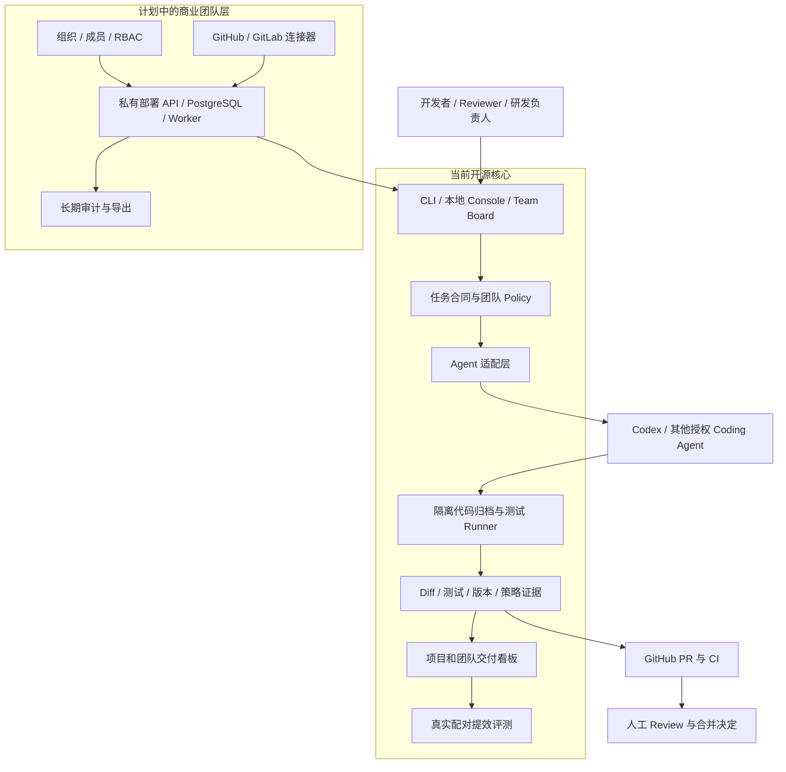

# 研序商业化路线与团队版 Plan

日期：2026-09-15。当前产品版本：v0.17.1（发布候选）。

## 1. 当前结论

研序已经具备向其他开发团队提供**固定范围私有化试点**的产品基础，但尚未达到成熟 SaaS 或标准企业软件的状态。

当前可卖的不是一个“比现有模型更会写代码”的模型产品，而是一套 AI Coding 交付治理能力：把任务范围、允许修改的文件、批准的测试命令、PR/CI 状态、人工复核和实际提效证据连成可追溯流程。

首个商业目标是让一个真实团队在自己的代码库和 GitHub 流程中完成试点并验收。没有真实客户、持续使用和付费续约前，不宣称已商业化成功。

## 2. 目标客户与购买角色

首批目标客户是假设，需要通过访谈和试点验证：

- 5–50 人的软件研发团队，已经使用 GitHub 和 CI。
- 团队成员正在使用 Codex、Copilot、Claude Code 或其他 Coding Agent。
- 代码不能随意上传，负责人关心 AI 修改范围、测试质量和审计证据。
- 多个开发者各自使用 AI，但团队缺少统一规则和提效口径。

日常使用者是开发者和 Reviewer；主要购买决策者是技术负责人、研发经理、CTO 或研发效能负责人。

## 3. 核心付费场景

1. **团队接入**：把一个现有仓库的目录范围、测试命令和 GitHub 流程固化为团队规则。
2. **受控开发**：Agent 只能在批准范围内生成改动，并在隔离副本中执行指定测试。
3. **合并前验收**：候选改动先经过本地测试和 PR CI；检查不通过时阻断，不把失败结果包装成可合并。
4. **合并后核验**：主分支 CI 验证实际合并版本；未来接入 CD 时再绑定制品、环境版本和验收结果。
5. **团队证据**：负责人查看跨仓库的任务、测试、人工审查、失败和策略版本，不读取或上传业务源码。
6. **提效验收**：用相同任务范围、相同质量门槛的配对记录衡量人工时间，失败和返工也计入。

## 4. 产品架构

## 5. 开源与收费边界

| 层级 | 保持开源 | 商业团队版 / 服务 |
| --- | --- | --- |
| 单项目开发 | 任务合同、受控实现、隔离测试、PR/CI 审查 | 仓库接入、规则设计和验收服务 |
| 团队规则 | 文件化 Policy、策略指纹 | 组织级模板、审批、版本分发与变更审计 |
| 可视化 | 单项目 Board、私有 Team Workspace Alpha | 多成员权限、集中查询、长期留存与报表导出 |
| 集成 | `gh` CLI 和文件化工作流 | GitHub App、GitLab、Webhook、SSO 和企业目录 |
| 运行方式 | 本地 CLI、静态 HTML | Docker 私有部署、升级、备份、监控和 SLA |
| 效果衡量 | 配对记录和公开计算方法 | 客户基线设计、试点复盘和团队 ROI 报告 |

当前代码采用 MIT。已经公开的版本可以被自由使用和 fork，因此长期壁垒来自稳定集成、团队治理、可验证效果、升级维护和交付服务。

## 6. 首个付费试点包

建议先销售四周、固定范围的私有化试点：

- 范围：1 个团队、1–3 个仓库、1 类主要技术栈、GitHub 优先。
- 第 1 周：现状访谈、人工基线、仓库体检和团队 Policy。
- 第 2 周：安装、权限核对、受控开发与 PR/CI 流程接入。
- 第 3 周：真实任务运行、问题修复和证据看板。
- 第 4 周：完成至少 5 个质量通过的配对任务，输出验收和 ROI 报告。

交付物包括私有安装、规则包、团队看板、运行证据、使用手册、验收报告和约定期限的支持。模型费用、CI 费用和客户要求的定制开发单独记录。

首轮价格采用验证方式，不在没有客户访谈时假装已有市场定价。可以分别测试 ¥9,800、¥19,800、¥29,800 的四周试点报价，观察客户是否愿意进入付费评估；最终报价依据仓库数、接入复杂度、支持投入和部署要求确定。

## 7. 成功指标

### 主指标

**质量通过任务的人工分钟减少率**：

`(基线人工分钟 - 研序人工分钟) / 基线人工分钟 × 100%`

只有任务范围一致、两边质量都通过的配对任务才计算。少于 5 个真实有效样本时只标记探索结果，不外推为整个团队效率。

### 驱动指标

- 首个仓库从安装到完成一条可审查任务的时间。
- 团队 Policy 覆盖的任务数和仓库数。
- 首次 CI 通过率与每任务返工次数。
- 从任务合同到 Ready for Review 的人工分钟。
- 每周有质量通过交付的活跃仓库数。

### 商业指标

- 访谈到试点的转化率。
- 试点按约定完成验收的比例。
- 试点后继续付费支持或采购团队版的比例。
- 扣除模型、CI 和人工支持后的单试点毛利。

### 守护指标

- 未授权远端写入：0。
- 客户秘密进入公开仓库：0。
- 将失败状态错误标记为可合并：0。
- 每任务人工救火时间和模型/CI 成本必须可见。

`20%` 可以作为首轮试点的方向性门槛，不能在完成真实配对测量前写成已经实现的收益。

## 8. 下一阶段开发顺序

| 阶段 | 计划交付 | 退出条件 |
| --- | --- | --- |
| v0.14 试点证据包（已完成） | `team export` 导出可交付证据包；展示每个仓库的 Policy、测试、PR/CI 与测量状态 | ZIP 可离线审查并带文件哈希；不包含源码、原始运行产物、凭据和本地登记路径 |
| v0.15 本地 GitHub 只读同步（已完成） | 为项目登记/更新当前 PR；通过 `gh` 同步 commit、PR、CI 和判断；部分失败可见 | 持久化快照绑定实际 commit；不保存 diff、正文或日志；不执行远端写入 |
| v0.16 私有服务最小切片（已完成） | FastAPI、PostgreSQL、组织令牌、owner/viewer、幂等快照、审计、Docker Compose | 跨组织隔离通过；明文令牌不入库；数据库重建并恢复备份后取得同一快照 ID/指纹 |
| v0.16.1 GitHub 事件接入（已发布） | GitHub App/Webhook、Worker、delivery 去重、安装撤权 | 错签名拒绝；重复事件只处理一次；撤权后停止处理；队列与审计可查询 |
| v0.17.0 试点工作台（已发布） | Token 登录、接入进度、工作空间/PR/CI/Webhook 页面、审计导出 | 会话只存哈希；Token 撤销联动；跨组织隔离；真实浏览器登录/退出通过 |
| v0.17.1 成本与试点包（发布候选） | 按币种记录模型/CI/基础设施/支持实际成本；导出带哈希 manifest 的 ZIP | 精确金额、owner 写权限、组织隔离、浏览器下载和哈希复算通过；提效状态固定为 `NOT_MEASURED` |
| v0.17.x 付费试点验收 | 升级和故障手册、试点验收流程 | 1 个外部团队完成约定任务；验收结果、支持投入和费用可核对 |
| 托管团队版 | 只有持续付费需求成立后建设 SSO、托管隔离、订阅和 SLA | 至少 2 个试点完成、1 个继续付费，并确认客户确实需要托管 |

下一项代码优先级是 **v0.17.x 升级与故障恢复手册**。私有 API、PostgreSQL、组织权限、GitHub 事件队列、团队网页、实际成本、接入进度、审计与试点 ZIP 已实现；下一步验证备份、升级、回滚和常见故障恢复，再启动外部团队试点。

## 9. 5W2H 复核

| 项目 | 结论 |
| --- | --- |
| What | AI Coding 交付治理和提效验收平台 |
| Why | 团队缺少统一范围、测试、PR/CI 证据、审计和真实 ROI 口径 |
| Who | 5–50 人开发团队；开发者使用，技术负责人购买 |
| When | v0.16 私有服务、v0.16.1 GitHub 事件接入、v0.17.0 工作台已发布，v0.17.1 成本与试点包进入发布候选；下一阶段完成升级故障手册并启动四周试点；SaaS 由付费续约触发 |
| Where | 客户本地或内网优先，GitHub 流程优先 |
| How | 开源 CLI + 团队规则 + 隔离 Runner + PR/CI + 私有看板 + 服务交付 |
| How much | 首批通过三档试点报价测试；真实成本含模型、CI、支持和定制工时 |

## 10. 竞争判断

GitHub 已经可以让 Coding Agent 从 Issue 生成 PR，并提供企业策略和 Agent 审计；GitLab 也提供覆盖软件生命周期的 Agent 平台和自托管模型。因此，“能自动输出代码”本身不足以形成差异。[GitHub Agent 入门](https://docs.github.com/en/copilot/how-tos/copilot-on-github/use-copilot-agents/overview) · [GitHub 企业 Agent 管理](https://docs.github.com/en/copilot/concepts/enterprise/agent-management) · [GitLab Duo Self-Hosted](https://docs.gitlab.com/administration/gitlab_duo_self_hosted/)

研序应保持模型和 Agent 可替换，把优势集中在：客户自己的交付规则、生成前的权限约束、生成后的版本化证据、私有部署以及包含失败/返工的 ROI 验收。

Superpowers 是 Agent 技能和软件开发方法框架，适合增强计划、测试、调试和评审；研序负责团队级交付治理和证据。两者可以组合使用，不需要复制它的技能库。[Superpowers](https://github.com/obra/superpowers)

## 11. 面试与对外表述

当前可以表述：

> 我开发了 Yanxu Dev v0.17.1，用任务合同和团队 Policy 限制 AI 修改范围，在隔离副本中生成代码并自动测试；团队工作空间可同步多个项目的真实 PR/CI 状态，并将标准化证据保存到组织隔离的 PostgreSQL 私有服务。服务包含 owner/viewer、哈希令牌、幂等写入、审计、GitHub Webhook 队列和 Docker 部署；浏览器工作台可记录分币种实际成本并导出带哈希 manifest 的试点 ZIP，未完成真实配对测量时明确标记 `NOT_MEASURED`。已完成本地跨组织、浏览器和 Docker 合成验收；下一阶段是真实团队试点。

暂时不要表述为“已实现全自动研发”“已提升团队效率 20%”“已有商业客户”或“已完成企业 SaaS”，除非后续有对应的真实证据。
