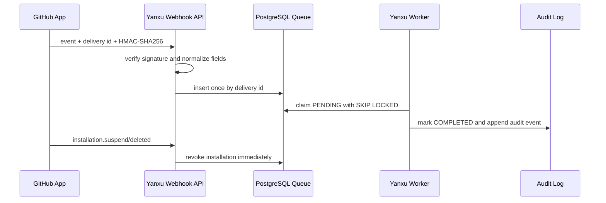

# GitHub App 与 Webhook 接入

Yanxu Dev v0.16.1 接收客户自建 GitHub App 的事件。Webhook 只进入已经由组织 owner 绑定的 installation；签名、delivery 去重和撤权状态都在写入队列前检查。

## 工作流



| 项目 | 当前实现 |
|---|---|
| 输入 | GitHub App Webhook、`X-GitHub-Delivery`、`X-GitHub-Event`、`X-Hub-Signature-256` |
| 处理 | 对原始字节做 HMAC-SHA256；组织 installation 映射；字段白名单；幂等队列；独立 Worker |
| 输出 | delivery 状态、标准化 PR/check/status 事实、安装状态和审计事件 |
| 保存范围 | repo、PR 号/状态、head/base SHA、CI 状态、发送者、installation id |
| 排除范围 | 源码、diff、PR 标题/正文、check 日志、App 私钥、Webhook 明文 secret |
| 验收 | 错签名 401；重复 delivery 只处理一次；跨组织不可见；suspend/deleted 后停止处理 |

## GitHub 端配置

1. 在组织或个人账号下创建 GitHub App。
2. Webhook URL 填写 `https://YOUR_YANXU_HOST/webhooks/github`。
3. Webhook secret 使用高熵随机值，并将同一值只放入私有部署的 `YANXU_GITHUB_WEBHOOK_SECRET`。
4. 订阅 `Pull request`、`Check run`、`Check suite`、`Commit status`、`Installation` 和 `Installation repositories`。
5. 按最小权限开放 `Metadata: read`、`Pull requests: read`、`Checks: read`、`Commit statuses: read`。当前 Worker 不调用 GitHub API，不需要 Contents 写权限。
6. 安装 App 后，从安装页面取得 installation id，由 Yanxu 组织 owner 显式绑定。

生产地址必须为 HTTPS，并由客户自己的反向代理和网络策略保护。GitHub 要求在处理前使用原始请求体与 `X-Hub-Signature-256` 验证签名：[官方说明](https://docs.github.com/en/webhooks/using-webhooks/validating-webhook-deliveries)。

## 绑定 installation

```bash
curl -X POST https://YOUR_YANXU_HOST/v1/github/installations \
  -H "Authorization: Bearer $YANXU_API_TOKEN" \
  -H 'Content-Type: application/json' \
  -d '{"github_installation_id":12345678,"account_login":"your-org"}'
```

同一个 GitHub installation 不能分配给两个 Yanxu 组织。owner 可以再次绑定本组织的 installation，以更新账号名或在人工核对后重新激活。

## Worker 与事件查看

Docker Compose 默认启动 `db`、`app` 和 `worker` 三个服务。Worker 使用 `FOR UPDATE SKIP LOCKED` 领取一条 `PENDING` delivery，并在同一事务中标记完成和写入审计。

```bash
docker compose ps
docker compose logs worker
curl https://YOUR_YANXU_HOST/v1/github/deliveries \
  -H "Authorization: Bearer $YANXU_API_TOKEN"
```

不用 Docker 时可以运行一次或常驻 Worker：

```bash
python -m yanxu worker --once
python -m yanxu worker --interval 2
```

## 已验证边界

仓库测试使用 GitHub 官方 `Hello, World!` 签名向量，并覆盖伪造签名、重复 delivery、组织隔离、PR 私密文本剔除、Worker 处理以及 installation suspend 后拒绝后续事件。没有配置真实公网 HTTPS 和客户 GitHub App 时，只能称为“接入能力已实现并通过合成验收”，不能称为已经连接客户生产仓库。
