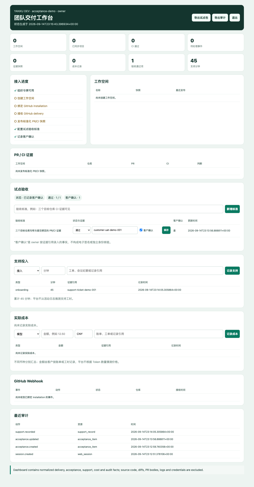

# 私有试点验收与支持证据

Yanxu Dev v0.20.0 面向 5–50 人研发团队的试点负责人、技术负责人和交付支持人员。它把售前约定、实际验收结果和支持投入放进组织隔离的工作台与证据包，帮助双方判断是否值得续费。

截图使用本地合成组织和演示证据引用，不代表真实客户验收。

## 核心场景

owner 在试点开始时配置可核验的验收标准，例如“3 个目标仓库能够显示与 commit 绑定的 PR/CI 证据”。执行后将单项标为 `PASS`、`FAIL` 或 `PENDING`；`PASS` 和 `FAIL` 必须填写工单、会议纪要或验收文档引用。只有 `PASS` 可以记录“客户确认”。

owner 还可以按接入、配置、故障、培训或其他类型记录实际支持分钟和证据引用。viewer 可以读取清单和汇总，不能新增或修改记录。

## Agent 工作流与数据边界

1. 输入：验收标准、状态、证据引用、客户确认布尔值；支持类型、分钟和证据引用。
2. 处理：FastAPI 校验字段，PostgreSQL 按 `organization_id` 隔离写入，owner 写操作进入审计事件。
3. 工具调用：浏览器会话只调用当前私有服务；本功能不读取仓库源码，不调用模型，不修改 GitHub PR、CI、merge 或部署。
4. 输出：工作台汇总、组织级 API、`acceptance.json`、`support.json` 和带 SHA-256 manifest 的试点 ZIP。

`CUSTOMER_CONFIRMATION_RECORDED` 表示 owner 已录入客户确认及证据引用，不是电子签名，也不是平台对客户身份的独立核验。没有外部确认时，验收状态只能是 `NOT_CONFIGURED`、`NEEDS_REVIEW` 或 `INTERNAL_PASS`。

## API

浏览器登录后可使用：

- `GET /v1/pilot/acceptance`：读取本组织验收项和汇总。
- `POST /v1/pilot/acceptance`：owner 新增 `PENDING` 验收标准。
- `PATCH /v1/pilot/acceptance/{item_id}`：owner 更新状态、证据和客户确认。
- `GET /v1/pilot/support`：读取本组织支持记录和累计分钟。
- `POST /v1/pilot/support`：owner 记录一次支持投入。
- `GET /v1/pilot/export`：导出包含验收、支持、成本、审计和交付状态的证据 ZIP。

这些响应均使用 `Cache-Control: no-store`。API 不接收客户姓名、签名、代码、diff、PR 正文、日志或凭证。

## 效率指标与商业价值

试点阶段应同时核对：

- 约定验收项总数、PASS/FAIL/PENDING 数和客户确认数。
- 接入、配置、故障、培训的实际支持分钟。
- 模型、CI、基础设施和支持成本。
- 质量匹配的人工基线与 AI 辅助任务时间；样本不足时继续标记 `NOT_MEASURED`。

这些数据支持“是否完成约定、交付成本多少、客户是否确认、是否值得续费”的商业判断。它们本身不证明收入，也不能替代合同、发票或客户签字文件。

## 验收标准

- owner 可创建验收项和支持记录，viewer 写入返回 403。
- `PASS`/`FAIL` 缺少证据引用时拒绝，客户确认只允许用于 `PASS`。
- 两个组织互不可见，跨组织 item id 更新返回未找到。
- 工作台转义全部动态文本，不显示源代码或凭证。
- ZIP 中 6 个 JSON 文件的哈希均可从 manifest 复算；manifest 同时保留提效和客户确认声明边界。
- PostgreSQL、Linux、Windows CI 与真实浏览器流程通过后才发布版本。

## 面试表达价值

可以表述为：我把 AI Coding 工具从代码生成延伸到团队试点交付，设计了组织隔离的验收清单、客户确认记录、支持工时和可复算证据包，使技术负责人能够核对交付结果与服务成本；系统明确区分内部验证、客户确认记录和真正外部签字，避免把演示数据包装成商业结果。
