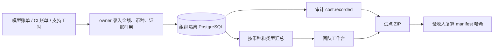

# 实际成本与试点证据包

Yanxu Dev v0.17.1 为私有团队试点增加成本台账和可离线核验的 ZIP。目标用户是技术负责人、研发效能负责人和试点验收人；它回答“本次试点实际花了多少钱、交付状态是什么、证据能否复算”，不会用 Token 数量猜价格，也不会把成本记录包装成提效或 ROI 结论。

## 工作流



| 项目 | 设计与边界 |
|---|---|
| 输入 | `model`、`ci`、`infrastructure`、`support` 或 `custom`；十进制金额；三位大写币种；账单、工单或工时记录引用 |
| 权限 | owner 可写；owner/viewer 可读取本组织数据；跨组织查询为空 |
| 金额 | API 接受字符串，最多 6 位小数；数据库保存整数微单位，避免二进制浮点误差 |
| 汇总 | 按币种和成本类型分别求和；不做汇率换算，不从 Token 数推断金额 |
| 工具调用 | 浏览器只调用本私有服务；服务读写 PostgreSQL；不读取源码、diff、PR 正文或日志 |
| 输出 | 工作台成本表、`cost.recorded` 审计，以及 `/v1/pilot/export` 下载的 ZIP |
| 效率指标 | ZIP 固定写入 `efficiency_claim_status=NOT_MEASURED`；只有完成配对任务测量后才能另行报告人工时间减少率 |

## API 与界面

登录 `/app` 后，owner 可在“实际成本”区录入：

```json
{
  "category": "model",
  "amount": "12.50",
  "currency": "CNY",
  "evidence_ref": "invoice-or-timesheet-reference"
}
```

`amount` 必须是 JSON 字符串。`12.50` 保存为 `12500000` 微单位，对外规范化显示为 `12.5`。证据引用只应保存脱敏后的内部编号或路径说明，不应包含账单原文、客户秘密、访问令牌或个人信息。

| 方法 | 路径 | 角色 | 返回 |
|---|---|---|---|
| GET | `/v1/costs` | owner/viewer 浏览器会话 | 本组织记录和分币种/类型汇总 |
| POST | `/v1/costs` | owner 浏览器会话 | 新成本记录；同时写入审计 |
| GET | `/v1/pilot/export` | owner/viewer 浏览器会话 | `yanxu-pilot-ORG.zip` 与 `X-Yanxu-Evidence-Fingerprint` |

## ZIP 合同

v0.20.0 的试点包包含六个文件：

- `summary.json`：工作空间、PR/CI、Webhook、成本与审计的组织级摘要。
- `costs.json`：最多 200 条成本记录和分组汇总。
- `acceptance.json`：验收标准、状态、证据引用和 owner 记录的客户确认。
- `support.json`：最多 200 条支持投入及累计分钟。
- `audit.json`：组织级审计导出及自身指纹。
- `manifest.json`：前五个文件的路径、字节数和 SHA-256，以及整个 manifest 的指纹。

`manifest.json` 的 `fingerprint` 计算方式：先移除 `fingerprint` 字段，再按键排序并用紧凑 JSON 分隔符编码为 UTF-8，最后计算 SHA-256。manifest 不把自身放入文件哈希列表，避免循环依赖。

## 验收标准

1. `12.50` 精确保存为 `12500000` 微单位，超过 6 位小数时返回 422。
2. viewer 写入返回 403；其他组织看不到当前组织成本。
3. 不同币种分别汇总，不生成隐含汇率或总 ROI。
4. ZIP 只含约定的六个文件；manifest 中每个文件哈希均可复算。
5. 响应头指纹等于 manifest 指纹；manifest 明确标记 `NOT_MEASURED`。
6. 浏览器能完成登录、成本录入、页面刷新和 ZIP 下载，控制台无错误。

## 商业与面试价值

成本台账让四周试点可以核对模型、CI、基础设施和支持投入，试点包让客户在离线环境复查交付和审计证据。收费仍来自私有部署、仓库接入、团队规则、验收与支持服务；当前功能不是订阅计费系统，也没有证明外部客户付费或固定提效比例。

面试中可以表述：

> 我把 AI Coding 的交付状态、实际成本和审计证据按组织保存，并提供带 SHA-256 manifest 的离线试点包。金额使用整数微单位并按币种分别汇总，未完成真实配对测量时系统明确输出 `NOT_MEASURED`，避免把模型用量或演示数据误写成 ROI。
