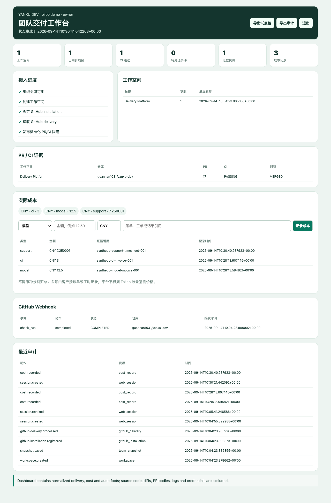
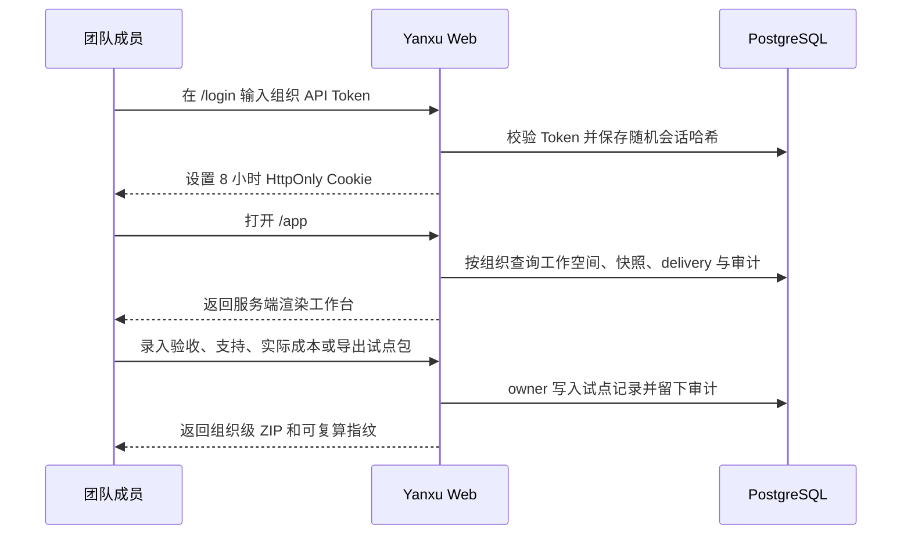

# 私有团队工作台

Yanxu Dev v0.20.0 的私有团队服务提供可直接操作的浏览器入口。它服务于技术负责人和 Reviewer，把分散的工作空间、PR/CI 快照、GitHub Webhook、试点验收、支持投入、实际成本与审计记录集中到一个组织隔离页面。



## 使用流程



| 项目 | 当前实现 |
|---|---|
| 目标用户 | 5–50 人团队的技术负责人、Reviewer、研发效能负责人 |
| 输入 | 组织 Token、已发布的标准化快照、已验证 GitHub delivery、审计事件 |
| 页面 | 接入进度、工作空间、项目 PR/CI、Webhook 状态、试点验收、支持投入、实际成本、最近审计 |
| 会话 | 随机值只写浏览器 HttpOnly Cookie；数据库只保存 SHA-256 哈希；8 小时过期 |
| 撤权 | 退出立即撤销当前会话；底层 API Token 被撤销后，关联浏览器会话同时失效 |
| 导出 | `/v1/audit/export` 下载审计 JSON；`/v1/pilot/export` 下载摘要、验收、支持、成本、审计和 manifest 组成的试点 ZIP |
| 数据边界 | 不在页面或导出中包含源码、diff、PR 正文、日志、API Token 或 Webhook secret |

## 启动和登录

按[私有服务部署](PRIVATE_SERVICE.md)启动 Docker Compose 后，打开服务根地址会自动进入工作台或登录页：

```text
http://127.0.0.1:8080/
```

输入 `.env` 中的引导 Token，或 owner 通过 API 创建的其他组织 Token。登录页不会把 Token 放入 URL、`localStorage` 或 `sessionStorage`。

Compose 默认只监听本机 HTTP，因此示例中的 `YANXU_SECURE_COOKIES=false` 仅用于 `127.0.0.1`。通过 HTTPS 反向代理开放给团队时必须设置：

```dotenv
YANXU_SECURE_COOKIES=true
```

## 审计证据指纹

下载 JSON 的 `fingerprint` 是对移除该字段后、按键排序并使用紧凑分隔符编码的 UTF-8 JSON 计算 SHA-256。响应头 `X-Yanxu-Evidence-Fingerprint` 返回同一值。该指纹用于检测导出内容变化，不是数字签名。

成本记录与试点 ZIP 的字段、精度、权限和收益声明边界见[实际成本与试点证据包](PILOT_COSTS.md)，验收与支持字段见[试点验收与支持证据](PILOT_ACCEPTANCE.md)。

## 验收结果与边界

自动化测试覆盖 HttpOnly/SameSite Cookie、会话哈希、退出撤销、API Token 撤销联动、跨组织页面与导出隔离、动态文本 HTML 转义和指纹复算。Playwright 在真实 Chromium 中完成登录、页面读取和退出，截图使用本地合成组织与公开仓库事实。

owner 可在页面记录实际成本；viewer 只能读取本组织成本和导出证据。金额和试点包的完整边界见[实际成本与试点证据包](PILOT_COSTS.md)。当前服务还没有正式用户目录、SSO、密码找回、托管租户隔离、计费或真实外部团队验收；这些能力不能在简历或报价中写成已经完成。
