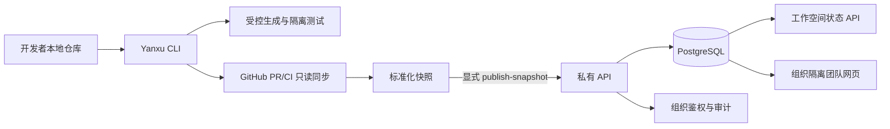

# 私有团队服务 Alpha

Yanxu Dev v0.17 把本地 `team sync-github` 生成的标准化交付证据和已验证 GitHub Webhook 事件保存到客户自己的 PostgreSQL。它面向有 GitHub/CI 的 5–50 人研发团队：开发者继续使用开源 CLI，技术负责人通过组织级 API 与[私有团队工作台](PILOT_DASHBOARD.md)查看持久化状态和审计记录。

## 当前闭环



| 项目 | 设计与验收 |
|---|---|
| 输入 | v0.15 `team-github.json` 标准化快照 |
| 处理 | 验证组织、工作空间和字段白名单；按内容指纹幂等入库 |
| 工具 | FastAPI、Psycopg、PostgreSQL、Docker Compose |
| 输出 | 工作空间列表、最新快照、令牌清单、审计 API 与团队工作台 |
| 权限 | `owner` 可写和管理令牌；`viewer` 只能读取本组织数据 |
| 数据边界 | 不保存源码、diff、PR 正文、日志或明文令牌；服务仍不评论、审批、merge 或部署 |
| 效率指标 | 减少负责人手工汇总 PR/CI 与交付证据的分钟数；真实百分比只用质量通过的配对任务计算 |
| 验收 | PostgreSQL 重启后快照恢复；跨组织读取返回 404/空集合；重复快照不重复审计；撤销令牌后不能鉴权 |

## Docker Compose 启动

需要 Docker Desktop（Windows/macOS）或 Docker Engine + Compose（Linux）。先复制环境模板；`.env` 已被 Git 忽略，不能提交真实密码或令牌。

```bash
cp .env.example .env
# 编辑 .env，将四个 replace-with... 值替换为本机随机值
docker compose up -d --build
docker compose ps
curl http://127.0.0.1:8080/healthz
```

Windows PowerShell：

```powershell
Copy-Item .env.example .env
# 用记事本编辑 .env，填入随机数据库密码、至少 24 字符令牌和 Webhook secret
docker compose up -d --build
docker compose ps
Invoke-RestMethod http://127.0.0.1:8080/healthz
```

端口默认只绑定 `127.0.0.1`。内网开放前应在 HTTPS 反向代理后部署，并配置防火墙；客户端会拒绝向非本机 HTTP 地址发送令牌。

启动后打开 `http://127.0.0.1:8080/login`，用组织 Token 登录团队工作台。本机 HTTP 保持 `YANXU_SECURE_COOKIES=false`；通过 HTTPS 反向代理开放时必须改为 `true`。

## 创建工作空间并发布真实快照

管理员令牌只放在当前终端环境变量中。以下示例值必须换成本机 `.env` 中的实际引导令牌，不要写入命令历史、文档或 Git。

```bash
export YANXU_API_TOKEN='your-private-bootstrap-token'

curl -X POST http://127.0.0.1:8080/v1/workspaces \
  -H "Authorization: Bearer $YANXU_API_TOKEN" \
  -H 'Content-Type: application/json' \
  -d '{"name":"Platform Team"}'

python -m yanxu team publish-snapshot runs/team-github/TIMESTAMP/team-github.json \
  --server http://127.0.0.1:8080 --workspace-id WORKSPACE_UUID
```

PowerShell 使用 `$env:YANXU_API_TOKEN` 保存当前会话的令牌。`publish-snapshot` 从环境变量读取它，输出中不回显令牌，也不将令牌写入项目文件。远程服务 URL 必须使用 HTTPS。

## API

服务启动后，本机可打开 `http://127.0.0.1:8080/docs` 查看 OpenAPI 交互文档。

| 方法 | 路径 | 角色 | 用途 |
|---|---|---|---|
| GET | `/healthz` | 无 | 数据库健康检查 |
| GET | `/login`、`/app` | 浏览器会话 | 登录和查看本组织团队工作台 |
| POST | `/v1/session`、`/logout` | Token / 浏览器会话 | 创建短期 HttpOnly 会话或立即撤销 |
| GET | `/v1/audit/export` | 浏览器会话 | 下载本组织带指纹审计 JSON |
| GET | `/v1/me` | owner/viewer | 核对当前组织和角色 |
| POST | `/v1/tokens` | owner | 创建一次性显示的新令牌 |
| GET | `/v1/tokens` | owner | 查看令牌元数据，不返回哈希或明文 |
| DELETE | `/v1/tokens/{id}` | owner | 撤销另一枚令牌 |
| GET/POST | `/v1/workspaces` | 读：全部；写：owner | 列出或创建本组织工作空间 |
| POST | `/v1/workspaces/{id}/snapshots` | owner | 幂等保存白名单化快照 |
| GET | `/v1/workspaces/{id}/snapshots/latest` | owner/viewer | 读取本组织最新快照 |
| GET | `/v1/audit` | owner/viewer | 读取本组织审计事件 |
| GET/POST | `/v1/github/installations` | 读：全部；写：owner | 查看或绑定本组织 GitHub App installation |
| GET | `/v1/github/deliveries` | owner/viewer | 查看标准化事件和 Worker 状态 |
| POST | `/webhooks/github` | GitHub HMAC | 验证、去重并排队 GitHub 事件 |

## 备份与恢复

下面的命令让 PostgreSQL 在容器内部生成二进制备份，再复制到当前目录，因此兼容 PowerShell，不依赖终端重定向编码。

```bash
docker compose exec -T db pg_dump -U yanxu -d yanxu -Fc -f /tmp/yanxu-backup.dump
docker compose cp db:/tmp/yanxu-backup.dump ./yanxu-backup.dump
```

恢复会覆盖当前私有数据库，应先停止 `app`，并只对已确认的备份执行：

```bash
docker compose stop app worker
docker compose cp ./yanxu-backup.dump db:/tmp/yanxu-backup.dump
docker compose exec -T db pg_restore -U yanxu -d yanxu --clean --if-exists /tmp/yanxu-backup.dump
docker compose start app worker
```

## 商业与面试价值

这一版把“个人 CLI 演示”推进为可安装、可浏览的私有团队服务：客户数据留在自己的 PostgreSQL，负责人可以分发只读账号，交付证据跨重启保留，并能核对谁创建了工作空间、发布了快照或管理了令牌。可收费内容是私有安装、团队 Policy 配置、仓库接入、验收和维护支持。

当前还没有外部付费客户或足够的真实配对任务，因此不能声称已经产生收入或固定提效比例。GitHub 事件能力的配置与边界见 [GitHub App 接入](GITHUB_APP.md)；下一步是用量成本记录、升级故障手册和四周真实团队试点验收。
